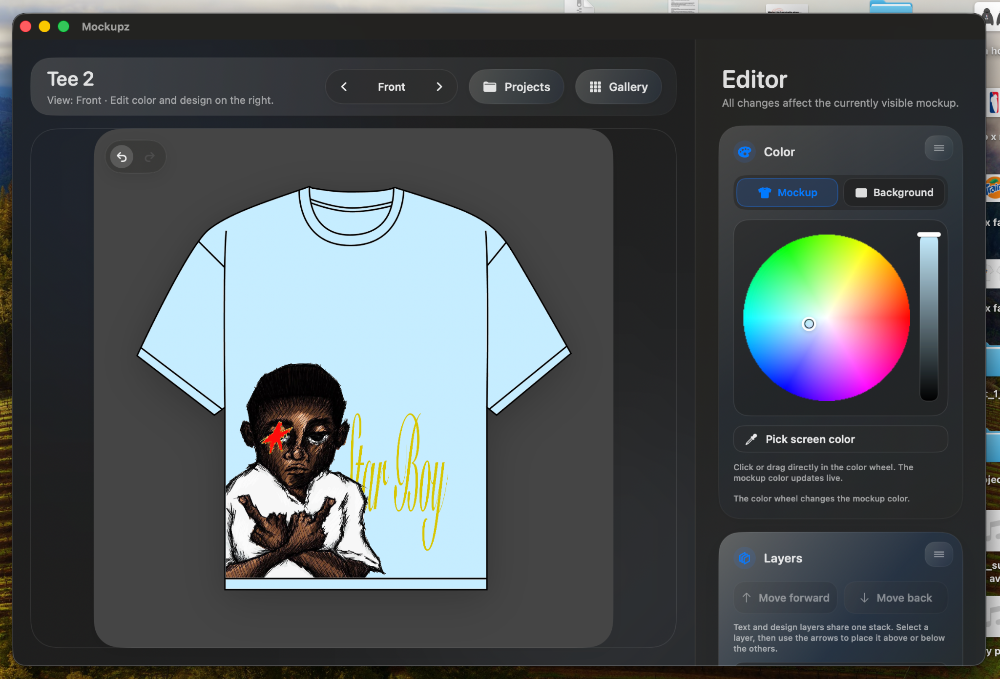

# Mockupz — Clothing Mockup Design App for macOS

**Turn clothing ideas into polished product visuals—without leaving your Mac.**

Mockupz is a native macOS clothing mockup editor for streetwear designers, apparel brands, graphic designers and print-on-demand creators. Choose from **110 clothing and accessory mockups with 232 selectable views**, add artwork and typography, recolor products, refine layers and export presentation-ready PNG files.

> **Private by design:** Mockupz works locally. No account, cloud upload or tracking is required in the current release.

  

## See Mockupz in action

  

## Why creators use Mockupz

- **110 built-in mockups, 232 views** — T-shirts, hoodies, jackets, pants, hats, bags and more.
- **Artwork and text layers** — Import designs, add typography and control the layer order.
- **Creative editing tools** — Brush, eraser, colorize, background removal, Cut Design and editable Bézier vector layers.
- **Precise transforms** — Move, rotate, resize, stretch and align elements directly on the canvas.
- **Fast color exploration** — Recolor the mockup or background with a color wheel, native macOS picker or screen eyedropper.
- **Non-destructive workflow** — Undo and redo changes while you work.
- **Project saving** — Continue your apparel design and mockup projects later.
- **PNG export** — Create clean visuals for product pages, portfolios, social media and client presentations.

## Built for

Mockupz is useful for clothing brands, streetwear labels, freelance designers, merch creators, print-on-demand sellers and anyone looking for a fast **T-shirt mockup generator**, **hoodie mockup maker** or **apparel design tool for Mac**.

## Download and install

1. Open the [latest GitHub Release](../../releases/latest).
2. Download the current Mockupz `.dmg` or `.zip` file.
3. Move **Mockupz.app** into your **Applications** folder.
4. Open Mockupz. If macOS blocks the first launch, go to **System Settings → Privacy & Security → Security → Open Anyway** and confirm the official downloaded copy.
5. No Screen Recording or Microphone permission is required for normal use.

**System requirement:** macOS 13 Ventura or newer.

Read the complete bilingual setup guide: **[Installation and macOS security instructions](INSTALLATION.md)**.

## Quick workflow

For a complete walkthrough, read **[the Mockupz tutorial](TUTORIAL.md)**.

1. Pick a garment or accessory from the gallery.
2. Choose the front, back or available alternate view.
3. Adjust the mockup and background colors.
4. Import artwork or create text and drawing layers.
5. Arrange, resize and refine the design.
6. Save the project or export a PNG.

## Privacy

Mockupz processes projects locally on your Mac. The current release does not require an account and does not include analytics, telemetry or cloud syncing.

## License and source code

Mockupz is **proprietary software**, not an open-source project. This repository is intended for compiled downloads, screenshots and release information only. The source code is not included.

Copyright © 2026 **trainer2k**. You may use the app under the terms in [`LICENSE.txt`](LICENSE.txt). Redistribution, resale, modification and extraction of bundled assets are not permitted unless the license explicitly allows it.

## Frequently asked questions

### Can I use my exported mockups commercially?
Yes. You may use exported images for your own personal or commercial presentations, storefronts and marketing, subject to the rights in artwork, logos, fonts and other content you import. See the license for the exact terms.

### Does Mockupz upload my designs?
No cloud upload is required in the current release. Projects and exports are handled locally.

### Is Mockupz open source?
No. The downloadable application is licensed for use, while all software rights remain with the copyright holder.

### Which files can I export?
Mockupz exports PNG images.

---

## Deutsch

**Mockupz ist eine native macOS-App für Kleidungs- und Streetwear-Mockups.** Die App enthält 110 Mockups mit 232 Ansichten und bietet Bild-, Text-, Zeichen- und Vektor-Ebenen, Farbänderungen, Hintergrundentfernung, Ebenensteuerung, Projekt-Speicherung sowie PNG-Export. Alles wird lokal auf dem Mac verarbeitet.

[Neueste Version herunterladen](../../releases/latest) · [Installation](INSTALLATION.md) · [Tutorial](TUTORIAL.md)
